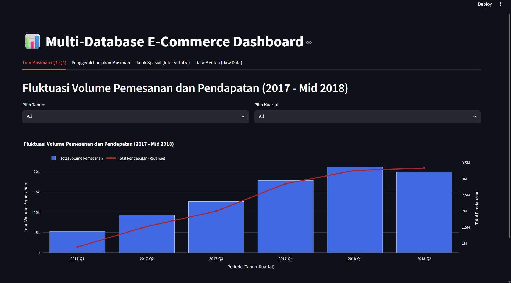
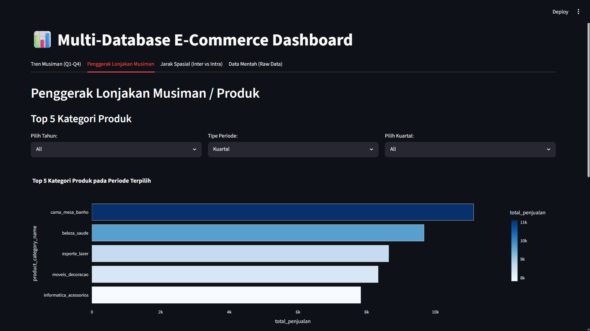
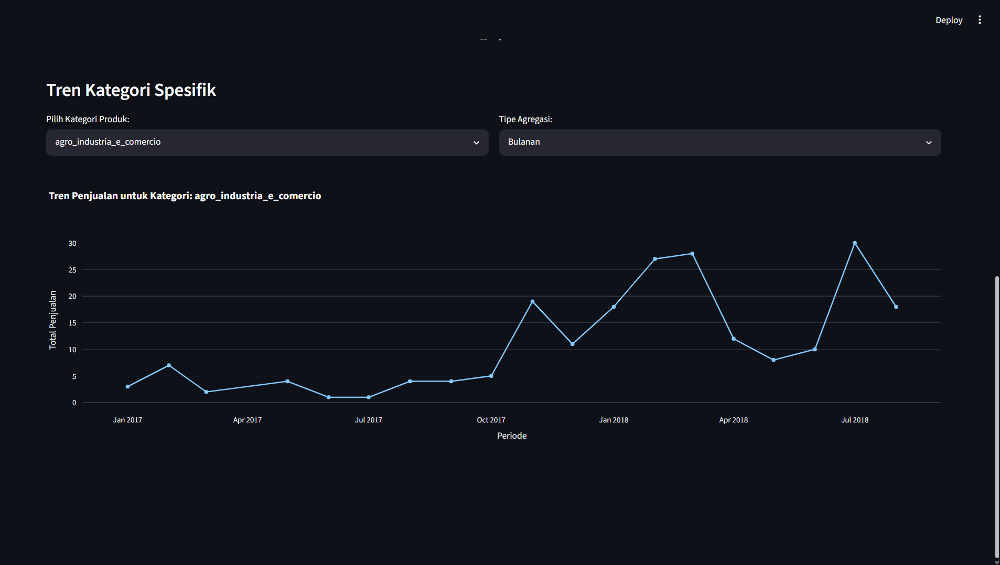
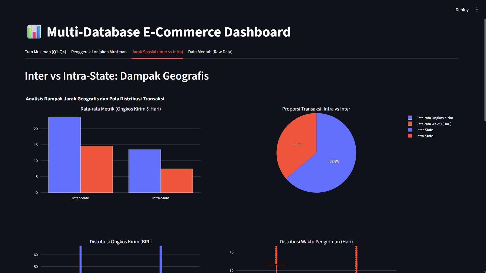
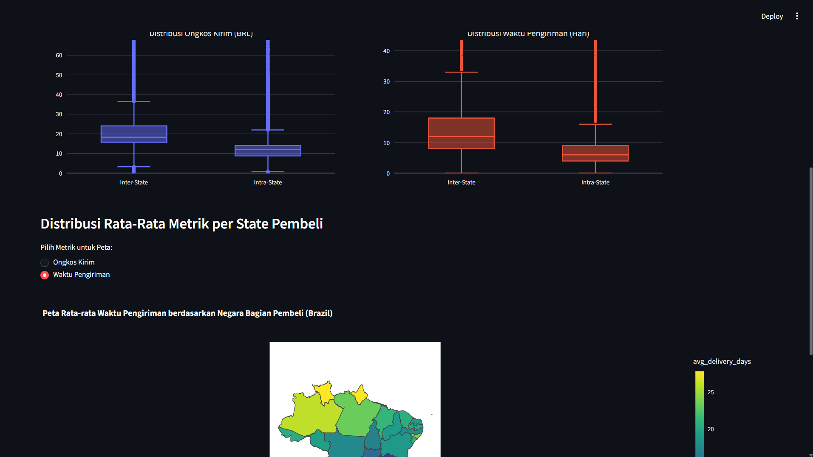

# E-Commerce Dashboard Analytics (Olist)

## Description (Background and Explanation)
Project ini merupakan aplikasi OLAP (*Online Analytical Processing*) berbasis *Dashboard* yang ditujukan untuk melakukan analisis mendalam terhadap transaksi e-commerce Olist (sebuah platform e-commerce terkemuka di Brazil). Aplikasi ini dibuat untuk menggali *insight* penting seperti tren fluktuasi penjualan musiman, mengetahui produk penggerak utama selama masa lonjakan pesanan (*peak season*), serta memahami dampak efisiensi logistik geografis antara lokasi penjual dan pembeli.

**Strategi Penyimpanan (Storage Strategy - Polyglot Persistence):**
Untuk memenuhi spesifikasi proyek pengembangan sistem OLAP dan mengelola arsitektur data secara optimal, kami menerapkan arsitektur *Hybrid Database* (SQL dan NoSQL secara simultan):
- **Relational Database (PostgreSQL):** Untuk menangani relasi skema tetap yang kuat.
- **NoSQL Database (MongoDB):** Untuk fleksibilitas struktur bersarang (*nested data*) seperti *order items* dan keragaman dokumen transaksi.

## Data Analysis (Entities and Attributes)
Data yang dianalisis berasal dari *Olist E-Commerce Dataset* yang secara strategis dibagi menjadi dua sistem *database*:

### 1. Relational Database (PostgreSQL)
*   **`olist_customers_dataset.csv`**: Menyimpan profil pembeli, dengan atribut penting seperti `customer_id`, `customer_zip_code_prefix`, `customer_city`, dan `customer_state`.
*   **`olist_sellers_dataset.csv`**: Menyimpan entitas profil penjual, dengan atribut penting seperti `seller_id`, `seller_zip_code_prefix`, `seller_city`, dan `seller_state`.
*   **`olist_products_dataset.csv`**: Menyimpan katalog rincian produk, dengan atribut identitas seperti `product_id` dan `product_category_name`.

### 2. NoSQL Database (MongoDB)
*   **`olist_payment_dataset.json`**: Menyimpan historis metode pembayaran.
*   **`olist_merged_orders_dataset.json`**: Merupakan koleksi / *document* transaksi utama e-commerce yang menyimpan relasi pesanan secara komprehensif. Koleksi ini menyimpan detail seperti `order_id`, `customer_id`, tanggal transaksi (`order_purchase_timestamp`), tanggal diterima (`order_delivered_customer_date`), serta sebuah struktur *array of sub-documents* **`order_items`** yang mengemas setiap produk yang dibeli (`product_id`), `seller_id`, harga (`price`), serta ongkos kirim (`freight_value`).

---

## Problems and Solutions

### Problem 1: Tren Musiman (Fluktuasi Volume dan Pendapatan)
**Deskripsi Masalah:**
Bagaimana fluktuasi total volume pemesanan dan total pendapatan (revenue) platform jika diagregasi berdasarkan kuartal (Q1-Q4) selama periode tahun 2017 hingga pertengahan 2018?

**Solusi & Implementasi (*How to Solve*):**
Kami mengekstraksi dimensi waktu (seperti Bulan dan Kuartal) yang diambil dari atribut `order_purchase_timestamp` pada *document* MongoDB `olist_merged_orders_dataset`. Kami kemudian menggabungkan data atau melakukan *query* agregasi nilai `price` dari dalam *array* `order_items` untuk mendapatkan total nilai pendapatan (*revenue*). Data kemudian dikelompokkan (*Group By*) berdasarkan Kuartal (Q1-Q4) dan Tahun untuk menghitung `COUNT(order_id)` dan `SUM(payment_value/price)`.

**Visualisasi:** 
Diimplementasikan melalui grafik **Multi-axis Line & Bar Chart** (Grafik Ganda). Sumbu-X merepresentasikan periode kuartal, sumbu-Y kiri merepresentasikan nilai total volume pesanan (Bentuk Batang/*Bar*), dan sumbu-Y kanan merepresentasikan nilai total pendapatan (Bentuk Garis/*Line*).

*(Screenshot Hasil Visualisasi Problem 1)*
>  

---

### Problem 2: Penggerak Lonjakan Musiman (Produk)
**Deskripsi Masalah:**
Pada kuartal dengan lonjakan transaksi tertinggi (*peak season*), kategori produk apa yang mengalami peningkatan persentase penjualan paling signifikan dibandingkan kuartal lainnya?

**Solusi & Implementasi (*How to Solve*):**
Berdasarkan hasil temuan di Problem 1, kami menyeleksi dokumen hanya di kuartal puncak tersebut. Proses diselesaikan dengan melakukan gabungan *query* antar-lingkungan (*hybrid*): menyatukan *document* transaksi MongoDB dengan tabel master `olist_products_dataset` di PostgreSQL. Dari sini dihitung nilai `COUNT(product_id)` yang dikelompokkan berdasar kategori produk, lalu dibandingkan dengan metrik riwayat bulan/kuartal.

**Visualisasi:** 
Ditampilkan menggunakan **Horizontal Bar Chart** dan **Line Chart** fungsional. Visualisasi ini menyoroti kategori 5 produk (*top 5 categories*) yang bertindak sebagai tulang punggung pendapatan selama *peak season*.

*(Screenshot Hasil Visualisasi Problem 2)*
>  
> 

---

### Problem 3: Inter vs Intra, Jarak Spasial
**Deskripsi Masalah:**
Bagaimana pengaruh perbedaan wilayah geografis (*intra-state* vs *inter-state*) antara lokasi penjual dan pembeli terhadap biaya logistik (*freight value*) dan efisiensi waktu pengiriman barang (*delivery performance*), serta bagaimana pola distribusinya pada transaksi e-commerce Olist?

**Solusi & Implementasi (*How to Solve*):**
Kami menyambungkan dokumen `olist_merged_orders_dataset` (mengurai nilai dari *array* logistik `order_items` serta menghitung durasi selisih tanggal kirim aktual dalam satuan hari) dengan dataset wilayah dari PostgreSQL (`olist_customers_dataset` dan `olist_sellers_dataset`). Algoritma mendeteksi kecocokan `customer_state` dan `seller_state`; jika sama dilabeli **Intra-State**, dan jika beda **Inter-State**.

**Visualisasi:** 
Visualisasi direpresentasikan secara komprehensif melalui Dasbor *Subplot* menggunakan Plotly:
1. **Grouped Bar Chart & Pie Chart**: Menampilkan perbandingan nilai rata-rata dari ongkos kirim dan hari antar rute, yang didampingi visualisasi proporsi persentase besaran volume transaksinya (*Pie Chart*).
2. **Distribution Box Plots**: Memperlihatkan dengan jelas bentuk "pola distribusi" nilai biaya logistik dan performa pengiriman. 
3. **Choropleth Geospatial Map**: Menerapkan peta wilayah Interaktif negara bagian Brazil yang disuntik dengan peta JSON *Topology* (GeoJSON). Gradasi *colormap* memperlihatkan negara bagian (*Customer State*) mana yang menjadi zona ongkos kirim dan durasi logistik terberat.

*(Screenshot Hasil Visualisasi Problem 3)*
>  
>  
